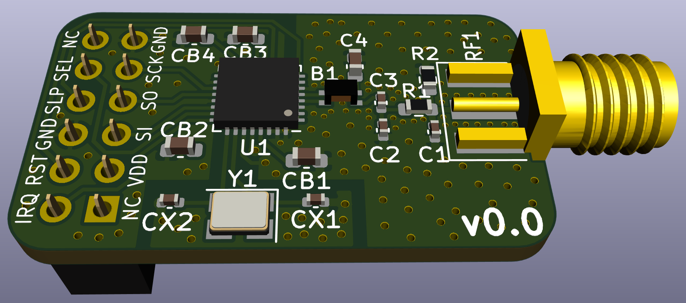

AT86RF212B Breakout
===================

This Repository contains an AT86RF212B breakout board that uses the basic
application schematic given in Section 5.1 "Basic Application Schematic" on
page 11 of the AT86RF212B datasheet (02/2015), with two differences:

1. The optional clock output is omitted
2. The sub-gigahertz antenna circuit from the [AT86RF215-XPRO](https://static5.arrow.com/pdfs/2015/6/30/10/21/54/282/atm_/manual/251atreb215-xpro_design_documentation.pdf)
   is used instead, but without shielding

This board is intentionally pin compatible with the openlabs RPI 802.15.4
radio. But note that the AT86RF212B differs from the AT86RF233 used in the
openlabs RPI 802.15.4 radio not only in the frequency band, but also behaves
slightly different. Thus, a driver for the AT86RF233 will not work unmodified
for the AT86RF212B.

WARNING
=======

1. The PCB contains no shielding for the RF filter, which will result in lower
   sensitivity and higher noise in the transmitted signal compared to e.g. the
   AT86RF215-XPRO reference design.
2. It is highly recommended to not order PCBs based on this design as of now.
   This design has never been tested.
3. The SMA connector for the antenna and the 2 x 6 pins 2.54 mm female pin
   header need to be hand soldered and are not part of the generated BOM.
4. There is absolutely no warranty.
